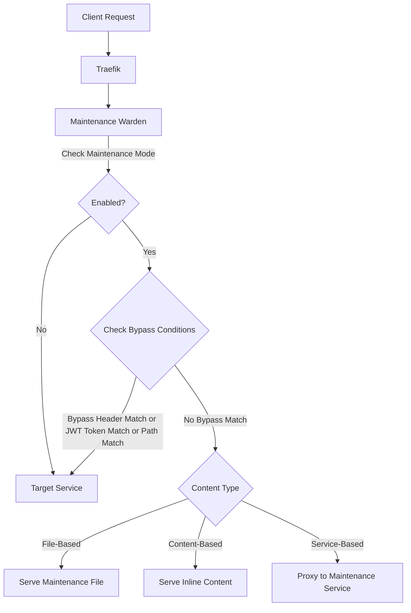

# Maintenance Warden: Flexible Maintenance Mode Plugin for Traefik

[](https://github.com/TechAlchemistry/traefik-maintenance-warden/actions/workflows/test.yml)
[](https://github.com/TechAlchemistry/traefik-maintenance-warden/actions/workflows/test.yml)
[](https://opensource.org/licenses/MIT)

**Professional service maintenance with intelligent bypass controls**

Maintenance Warden is a lightweight, high-performance middleware plugin for Traefik that provides a flexible maintenance mode solution for your services. It allows you to easily activate maintenance mode across your infrastructure while maintaining accessibility for authorized users through a configurable bypass header.

## Latest Release

**Version v1.1.0** adds important new features:
- **JWT Token-Based Bypass**: Use your existing JWT authentication flow to control access during maintenance

## Key Features

- **Triple-Mode Flexibility**: Choose between file-based, content-based, or service-based maintenance pages
- **Multiple Bypass Mechanisms**: Header-based, JWT token-based, and path-based access control
- **Selective Access Control**: Maintain service access for authorized users via configurable mechanisms
- **Path-Based Exceptions**: Configure specific paths to bypass maintenance mode automatically
- **Low Overhead**: Minimal performance impact with optimized request handling
- **Kubernetes Ready**: Easily integrate with your Kubernetes configuration

This plugin serves a maintenance page when maintenance mode is enabled, while allowing requests with specific bypass mechanisms to access the original service.

## How it Works

1. The middleware checks if maintenance mode is enabled
2. If disabled, all traffic passes through normally
3. If enabled, all incoming requests are checked for:
   - Presence of the bypass header with correct value
   - JWT token with specified claim value (if JWT bypass is configured)
   - Whether the path starts with any of the configured bypass paths
   - Whether the request is for favicon.ico (if bypassFavicon is true)
4. If any bypass condition is met, the request proceeds to the intended service
5. If no bypass condition is met:
   - If `maintenanceContent` is set, the middleware serves the inline HTML content
   - If `maintenanceFilePath` is set, the middleware serves the static HTML file
   - If `maintenanceService` is set, the request is proxied to the maintenance service
   - The configured status code is used (default: 503)

### Data Flow Visualization



## Design Philosophy

This plugin is designed with a focus on simplicity and reliability for static maintenance pages. It is optimized for the common use case of serving a simple "We're down for maintenance" page, rather than complex dynamic content.

The plugin offers three ways to serve maintenance pages:
1. **File-based**: Serve a static HTML file directly from disk
2. **Content-based**: Serve inline HTML content defined in the configuration
3. **Service-based**: Proxy requests to a dedicated maintenance service

The file-based and content-based approaches are simpler and more reliable, while the service-based approach offers more flexibility for dynamic content.

## Configuration

The plugin accepts the following configuration options:

```yaml
# Static maintenance mode
testMiddleware:
  plugin:
    traefik-maintenance-warden:
      enabled: true  # Enable/disable maintenance mode
      maintenanceContent: "<html><body>Site is under maintenance</body></html>"  # HTML content to display
      bypassHeader: "X-Maintenance-Bypass"  # Header name to bypass maintenance mode
      bypassHeaderValue: "true"  # Expected value of bypass header
      statusCode: 503  # HTTP status code to return (default: 503)
      bypassPaths:  # Paths that should bypass maintenance mode
        - "/healthz"
        - "/readyz"
      bypassFavicon: true  # Whether favicon.ico requests bypass maintenance (default: true)
      logLevel: 1  # Log level: 0=none, 1=error, 2=info, 3=debug (default: 1)
```

OR

```yaml
# Maintenance service
testMiddleware:
  plugin:
    traefik-maintenance-warden:
      enabled: true
      maintenanceService: "http://maintenance:8080"
      maintenanceTimeout: 5  # Timeout in seconds (default: 10)
      bypassHeader: "X-Maintenance-Bypass"
      bypassHeaderValue: "true"
      statusCode: 503
```

OR

```yaml
# Static maintenance file
testMiddleware:
  plugin:
    traefik-maintenance-warden:
      enabled: true
      maintenanceFilePath: "/path/to/maintenance.html"
      bypassHeader: "X-Maintenance-Bypass"
      bypassHeaderValue: "true"
      contentType: "text/html; charset=utf-8"  # Content type header (default: text/html; charset=utf-8)
```

With JWT token-based bypass:

```yaml
testMiddleware:
  plugin:
    traefik-maintenance-warden:
      enabled: true
      maintenanceFilePath: "/path/to/maintenance.html"
      bypassJWTTokenHeader: "Authorization"  # Header containing the JWT token (default: Authorization)
      bypassJWTTokenClaim: "maintenance-bypass"  # Claim name to check
      bypassJWTTokenClaimValue: "true"  # Expected claim value
```

# Configuration Reference

| Option | Type | Default | Description |
|--------|------|---------|-------------|
| `maintenanceService` | string | `""` | URL of the maintenance service to redirect to |
| `maintenanceFilePath` | string | `""` | Path to a static HTML file to serve instead of redirecting |
| `maintenanceContent` | string | `""` | Direct HTML content to serve instead of a file or service |
| `bypassHeader` | string | `"X-Maintenance-Bypass"` | Header name that allows bypassing maintenance mode |
| `bypassHeaderValue` | string | `"true"` | Expected value of the bypass header |
| `bypassJWTTokenHeader` | string | `"Authorization"` | Header containing the JWT token |
| `bypassJWTTokenClaim` | string | `""` | Claim name in the JWT token that contains the bypass value |
| `bypassJWTTokenClaimValue` | string | `""` | Expected value of the JWT token claim |
| `enabled` | bool | `true` | Controls whether the maintenance mode is active |
| `statusCode` | int | `503` | HTTP status code to return when in maintenance mode |
| `bypassPaths` | []string | `[]` | Paths that should bypass maintenance mode |
| `bypassFavicon` | bool | `true` | Controls whether favicon.ico requests bypass maintenance mode |
| `logLevel` | int | `1` | Controls the verbosity of logging (0=none, 1=error, 2=info, 3=debug) |
| `maintenanceTimeout` | int | `10` | Timeout for requests to the maintenance service in seconds |
| `contentType` | string | `"text/html; charset=utf-8"` | Content type header to set when serving the maintenance file |

## Technical Features

- **Multiple Maintenance Content Sources**:
  - Inline HTML content (simplest)
  - Static HTML file (simple and flexible)
  - External maintenance service (most powerful)

- **Bypass Mechanisms**:
  - HTTP header-based bypass
  - Path-based bypass (for health checks, etc.)
  - JWT token claim-based bypass for secure access
  
- **Operational Features**:
  - Configurable HTTP status code
  - Favicon bypass (to prevent console errors in browsers)
  - Detailed logging with configurable verbosity
  - Custom Content-Type header support

## How It Works

The plugin sits as a middleware in the Traefik request flow:

1. When a request comes in, the plugin checks if maintenance mode is enabled
2. If enabled, it checks if any bypass conditions are met:
   - Request has the bypass header with correct value
   - Request path matches one of the bypass paths
   - Request contains a JWT token with the correct bypass claim
   - Request is for favicon.ico (if enabled)
3. If any bypass condition is met, the request is passed to the normal service
4. Otherwise, the maintenance page is served with the configured status code

## Choosing Between Maintenance Page Options

### Content-based Maintenance (Simplest)
- **Pros**: Simplest setup, no dependencies, fastest performance, no file/network access
- **Cons**: Content must be included directly in configuration, limited size
- **Best for**: Simple static maintenance messages with minimal content
- **Ideal for**: Containerized environments where file persistence is limited or unavailable

### File-based Maintenance (Recommended for most cases)
- **Pros**: Simple, reliable, no network dependency, low overhead
- **Cons**: Static content only, must be deployed on each Traefik instance
- **Best for**: Most maintenance scenarios with simple static pages

### Service-based Maintenance
- **Pros**: Can serve dynamic content, centralized management
- **Cons**: Additional network dependency, higher latency, more points of failure
- **Best for**: Complex maintenance pages with dynamic content or when centralized management is required

## Security Best Practices

### Securing the Bypass Header

The bypass header mechanism allows authorized users to access the service during maintenance. To secure this feature:

1. **Use a non-obvious header name**: Avoid predictable names like `bypass` or `maintenance-bypass`
2. **Use a complex, random value**: Set a random string as the header value, not simple values like "true" or "1"
3. **Consider using HMAC**: For higher security, implement a time-based HMAC value mechanism
4. **Combine with IP restrictions**: When possible, restrict the bypass to specific IP addresses using Traefik's IPWhitelist middleware

### Using JWT Token Bypass

For environments that already use JWT-based authentication, you can leverage existing authentication mechanisms to control maintenance bypass:

1. **Use existing authentication**: Leverage your existing JWT infrastructure for maintenance bypass
2. **Role-based maintenance access**: Configure bypass based on user roles or permissions in the JWT
3. **Fine-grained control**: Grant maintenance access only to specific teams or individuals based on JWT claims
4. **Example configuration**:

```yaml
maintenance-warden:
  maintenanceContent: "<html><body><h1>Under Maintenance</h1><p>We'll be back shortly.</p></body></html>"
  bypassJWTTokenHeader: "Authorization"
  bypassJWTTokenClaim: "role"
  bypassJWTTokenClaimValue: "admin"
  enabled: true
  statusCode: 503
```

With this setup, only requests with a valid JWT token containing the claim `"role": "admin"` will bypass maintenance mode.

### Maintenance Service Security

1. **Use internal routing**: Keep your maintenance service in a protected internal network
2. **Set appropriate cache headers**: Ensure browser caching headers are set correctly on maintenance pages
3. **Implement rate limiting**: Use Traefik's RateLimit middleware in front of both your regular and maintenance services
4. **Monitor for abuse**: Enable logging (logLevel 2+) to monitor for repeated bypass attempts 

## Maintenance Page Best Practices

For the best user experience, your maintenance page should:

1. **Be lightweight and static**: Avoid complex dynamic content during maintenance
2. **Include estimated downtime**: Let users know when to check back
3. **Provide alternative contact methods**: Offer email or social media links when applicable
4. **Use appropriate status codes**: The default 503 is typically best for maintenance

## Building and Testing

```bash
go mod tidy
go test ./...
```

## Kubernetes Integration

When using with Kubernetes, define a middleware resource:

```yaml
apiVersion: traefik.containo.us/v1alpha1
kind: Middleware
metadata:
  name: maintenance-warden
  namespace: test-maintenance
spec:
  plugin:
    maintenance-warden:
      # For static file - mount a ConfigMap as a volume
      maintenanceFilePath: "/config/maintenance.html"
      
      # Or for service-based
      # maintenanceService: "http://maintenance-page-service.test-maintenance"
      
      bypassHeader: "X-Maintenance-Bypass"
      bypassHeaderValue: "true"
      enabled: true
      statusCode: 503
      bypassPaths:
        - "/health"
        - "/api/status"
      logLevel: 1
```

## Comprehensive Example

Here's a more comprehensive configuration example showing all options:

```yaml
http:
  middlewares:
    secured-maintenance:
      plugin:
        maintenance-warden:
          # Choose one of these options:
          maintenanceFilePath: "/etc/traefik/maintenance.html"  # File-based (preferred)
          # maintenanceService: "http://maintenance.internal"  # Service-based
          # maintenanceContent: "<html><body><h1>Under Maintenance</h1><p>We'll be back soon.</p></body></html>"  # Content-based
          
          # Content settings (for file-based and content-based)
          contentType: "text/html; charset=utf-8"
          
          # Basic settings
          enabled: true
          statusCode: 503
          
          # Security options
          bypassHeader: "X-Service-Access-Token"  # Custom non-obvious name
          bypassHeaderValue: "8f4j9FjWm2kDp3VxZsA7"  # Random complex value
          
          # JWT token bypass options
          bypassJWTTokenHeader: "Authorization"  # Header containing the JWT token
          bypassJWTTokenClaim: "role"  # Claim in the JWT token to check
          bypassJWTTokenClaimValue: "admin"  # Expected value of the claim
          
          # Path bypass options
          bypassPaths:
            - "/api/health"
            - "/metrics"
            - "/public/assets"
          bypassFavicon: true
          
          # Performance and debugging options
          logLevel: 2  # Info level logging
          maintenanceTimeout: 5  # 5 second timeout (for service-based only)
```

## Documentation

For more detailed information, see the documentation in the [spec](./spec) directory:

1. [**Technical Overview**](./spec/technical_overview.md) - Architecture, features, and technical implementation details
2. [**Audience and Use Cases**](./spec/audience_and_use_cases.md) - Target users and the problems the plugin solves
3. [**Deployment Guide**](./spec/deployment_guide.md) - How to deploy and configure the plugin in various environments
4. [**Benefits and Comparisons**](./spec/benefits_and_comparisons.md) - Key benefits and comparison with alternative approaches

## License

Maintenance Warden is licensed under the [MIT License](./LICENSE). 