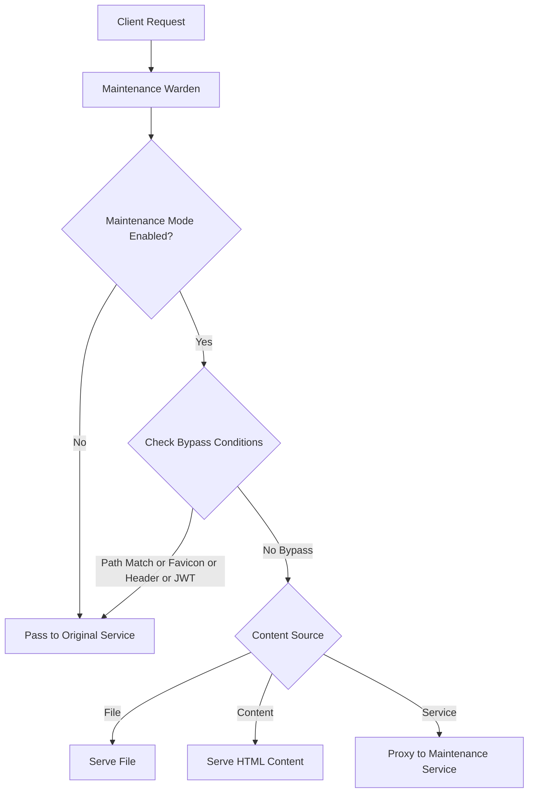

# Maintenance Warden: Technical Overview

## Architecture Overview

Maintenance Warden is a middleware plugin for Traefik that intercepts HTTP requests and conditionally redirects them to a maintenance page based on configurable criteria. The plugin is designed with a focus on performance, reliability, and flexibility.

### Core Components

1. **Request Interceptor**
   - Analyzes incoming HTTP requests
   - Checks for bypass conditions (headers, paths)
   - Makes routing decisions based on configuration

2. **Maintenance File Provider**
   - Reads and caches static HTML files
   - Monitors file changes for automatic reloading
   - Serves content with appropriate headers

3. **Maintenance Service Proxy**
   - Forwards requests to dedicated maintenance services
   - Handles timeouts and error conditions
   - Preserves request context where appropriate

4. **Bypass Mechanism**
   - Header-based bypass validation
   - Path-based bypass logic
   - Special case handling (e.g., favicon.ico)

5. **Annotation-Based Control**
   - Kubernetes annotation support for per-service maintenance mode
   - Dynamic enabling/disabling without configuration changes
   - Header-based annotation detection

### Data Flow

1. Request arrives at Traefik
2. Maintenance Warden middleware intercepts the request
3. If annotation support is enabled, check for maintenance annotations
4. If maintenance mode is disabled, request passes through to the target service
5. If maintenance mode is enabled:
   - Check for bypass header and value
   - Check for bypass path matches
   - Check for JWT token claim match
   - If any bypass condition is met, pass to target service
   - Otherwise, serve maintenance content (file or service)

## Request Flow

The plugin processes requests in the following order:

1. Incoming request arrives at the middleware
2. Check if maintenance mode is enabled (static configuration)
3. If disabled, pass request to the next handler
4. If enabled, check for bypass conditions:
   - Check if request path is in bypass paths list
   - Check if request is for favicon.ico (if configured)
   - Check if request has bypass header with correct value
   - Check if request has JWT token with correct claim value
5. If any bypass condition is met, pass request to the next handler
6. If no bypass condition is met, serve maintenance page:
   - If content-based, serve the inline content
   - If file-based, serve the file (cached or reload if modified)
   - If service-based, proxy to the maintenance service

### Data Flow Visualization

## Technical Features

The Maintenance Warden plugin offers a comprehensive set of features:

1. **Multiple Content Sources**
   - File-based maintenance page serving
   - Inline content-based serving
   - Maintenance service proxying

2. **Bypass Mechanisms**
   - Header-based bypass with configurable header name and value
   - Path-based bypass for health checks and critical endpoints
   - Favicon bypass to prevent browser console errors
   - JWT token-based bypass for role-based access control

3. **Performance Optimizations**
   - File content caching with modification detection
   - Minimal memory footprint
   - Efficient request handling

4. **Operational Features**
   - Configurable HTTP status code
   - Custom content type header
   - Detailed logging with configurable levels
   - Timeout configuration for maintenance service requests

## Technical Requirements

### Minimum Requirements
- Traefik v2.4 or later
- Go 1.16 or later (for development)

### Resource Consumption
- **Memory**: Minimal (~1MB base + size of maintenance file if used)
- **CPU**: Negligible impact on request processing
- **Disk**: None for service-based, minimal reads for file-based

### Performance Characteristics
- **Latency**: <1ms overhead for bypass logic
- **Throughput**: Negligible impact on Traefik throughput
- **Scalability**: Linear scaling with request volume

## Integration Points

### Traefik Integration
- **Plugin Type**: Middleware (HTTP request modifier)
- **Configuration**: Both static and dynamic configuration supported
- **Application**: Can be applied globally or to specific routers

### Kubernetes Integration
- **CRD Support**: Compatible with Traefik IngressRoute and Middleware CRDs
- **Deployment**: Can be deployed as part of Traefik Helm chart
- **Configuration**: Supports ConfigMap-based maintenance file mounting

### Monitoring Integration
- **Metrics**: No additional metrics exposed currently
- **Logs**: Compatible with standard Traefik log processing
- **Tracing**: Preserves Traefik tracing context

## Implementation Details

### Performance Optimizations
- **File Caching**: Maintenance files are cached in memory
- **Mutex Usage**: Read-write mutex for efficient concurrent access
- **Prefix Matching**: Fast path matching with prefix comparison
- **Header Lookup**: Direct header lookup without regex

### Security Considerations
- **Header Value Storage**: Header values stored in plain text (consider secure storage for sensitive values)
- **File Access**: Limited to specified file path only
- **Service Access**: Limited to specified maintenance service only
- **Input Validation**: URL and configuration validation at startup 